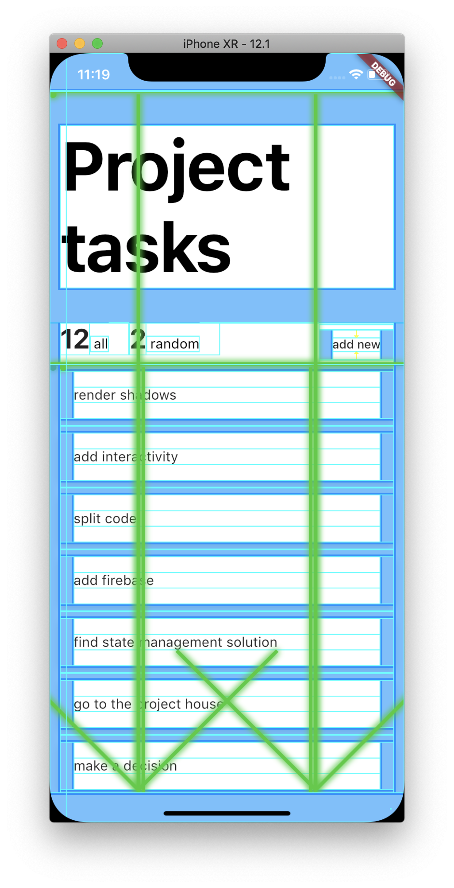

# Todo

A Flutter learning project. It consists of a mediocre todo application and my notes, describing my overall feeling about Flutter. Why todo app? Because it has information architecture similar to real life application and also considers state management and CRUD jobs. Also, because I'm not that creative

*Note:*
As this is a learning project, I might be wrong on some of the points, stay unbiased.

## Links I found useful

- [Docs: Technical overview of Flutter](https://flutter.dev/docs/resources/inside-flutter)
- [Docs: List of Flutter widgets](https://flutter.dev/docs/reference/widgets)
- [Medium: Why Flutter uses Dart](https://hackernoon.com/why-flutter-uses-dart-dd635a054ebf)
- [An awesome list on Flutter](https://github.com/Solido/awesome-flutter)

# Overall impression

Flutter looks nice. You can create pretty layouts with nice animations. There is little support for native looks and feel, unless you want your iOS app look like Material design application. Animations are just best, especially shared element transition. Objective oriented programming feels off at the beginning, but okay overall

# Notable features of Flutter

## 1. Identical look

Your app is guaranteed to look same on both platform. In React Native you typically build an iOS version with nice shadows to find out that shadows do not work on Android, and now you have to substitute them with some dirty elevations. Some other components will breakdown, paddings may disappear, dropdown boxes will behave and look in a completely different way.

Flutter achieves identical look not by using native modules, but instead by mocking and redrawing them using Skia - 2D graphics engine. There is no key, but there is a drawing. Flutter, I believe, is the easiest way to put Material design on iOS. Though, not sure if anyone would want it. There is also Cupertino library, but even from official demo videos it looks under developed.

Flutter also has a Theme setting for layouts, which allows to differentiate between platforms. I have used for basic styles and it works, however, I'm not sure how flexible this solution is

```
  // Example

  ...
  BoxDecoration(
    color: Theme.of(context).platform == TargetPlatform.iOS ? Colors.blue : Colors.red,
  )
  ...

```

Flutter rendering is nice, because:

  * The layout will look same
  * The layout will not turn into trash
  * You don't have to test UI on various devices versions
  * You can experiment with grids and animation

Flutter rendering is *not* nice, because:

  * The layout will look same
  * Modules are not native
  * Native look on both platforms is too hard to achieve

## 2. Dart language

As the programming language Flutter uses Dart, which is a compiled Object Oriented language. It gets compiled into native code, this way bypassing bridging. This way the application has better performance. Can confirm that animations do look smooth and application renders without any freezes.

Benefits of using Dart are described in this Hackernoon [article].(https://hackernoon.com/why-flutter-uses-dart-dd635a054ebf) The ones that do make difference in my opinion are: garbage collector designed to quickly create and destroy objects at almost no cost. Also it is strongly typed, has nice autocomplete support and is overall easy to learn. However, it is still an object oriented language, which is not in everyone's taste. Additionally, there is no alternative to XML/JSX, so the markup code feels like React without JSX

## 3. Editors support

Flutter has great plugins for VSCode and some other IDEs. Running Flutter application in debugging mode allows you to use features like baseline render, repainting map and a bunch more. The fact they exist is quite convenient. VSCode has great support for debugging, but some features like inspecting widget tree do not exist there. There is also support for stateful hot reload, which for some reason gets too much attention in other articles.


An example of debug painting overlay. There are also baseline rendering, repaint rainbow, performance metrics and so on.

Debugging is nice, because:

* Controlled by VSCode
* Has nice features like displaying baselines
* There is built-in documentation for everything

Debugging is not nice, because:

* Logs to console appear *before* hundreds of error messages from runtime errors
* Widget inspection just throws you at the place where you have defined the widget (VSCode)

## 4. Animations

Flutter is advertised as a way to create 'delightful apps', which is totally true. Flutter has great support for animations and covers some very popular cases. The best example is the shared element transition, which is barely possible with React Native, keeping the actual routing structure. In Flutter, however, shared element transition is achieved with Hero widget, which controls transition of the identical component as well as can pass it to the different route and back. Basically, Hero widget gets two same components with different properties, e.g. navigation action, font size, colors or anything else. Matching parameters get interpolated during the transition.

Apart from the shared element transition, everything else can be animated. There are staggered animations, an ability to override screen transitions, custom effects and much more.

## Navigation

Flutter has built-in navigation, which is a fantastic feature for people coming from React Native. Flutter uses the same approach of routes, but there are no strict requirements for organizing the routing pattern and there is no boilerplate code in contrast to React Native's several navigatino libraries. Navigation transitions by default depend on the system they are used on